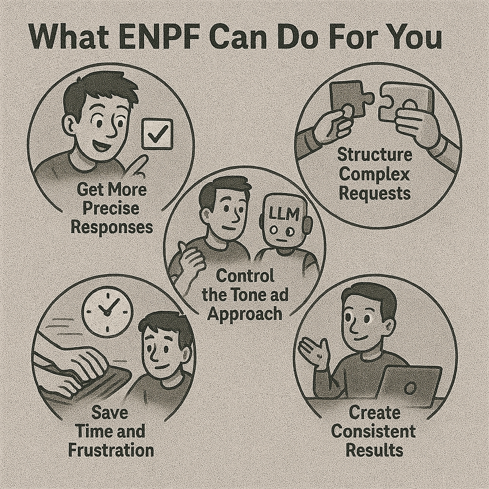
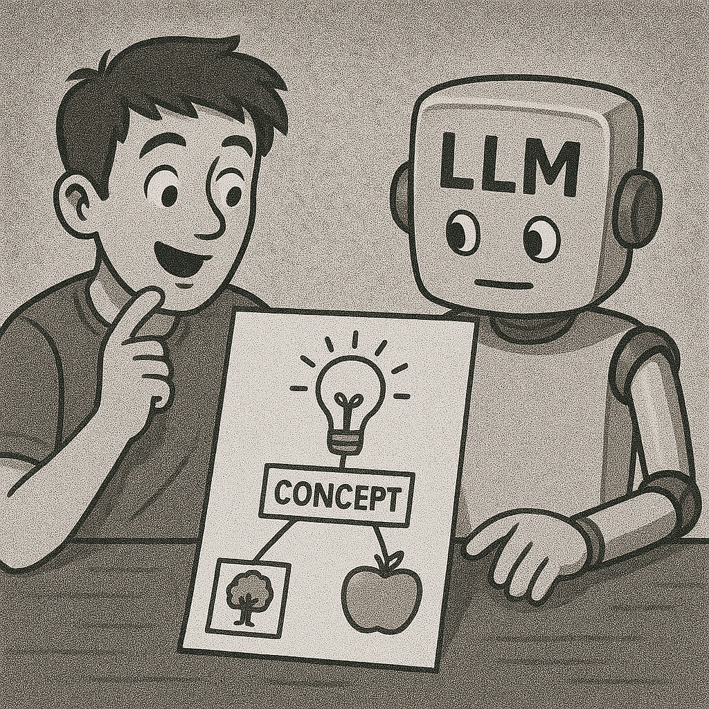

# The Human-Friendly Guide to Enhanced Natural Prompting Framework (ENPF)


## Why You Might Care About ENPF

Have you ever felt that talking to AI is like giving directions to someone who takes everything too literally? Or perhaps you've experienced the opposite — asking for something specific but getting a vague, generic response?

The Enhanced Natural Prompting Framework (ENPF) is designed to solve these problems. It's not about complicated programming or learning a new language. Instead, think of it as a simple set of signposts that help you guide AI toward giving you exactly what you need.

## What ENPF Can Do For You (Without the Jargon)



### 1. Get More Precise Responses

Instead of hoping the AI understands what you want, ENPF lets you clearly mark what's important.

### 2. Structure Complex Requests

When you need multiple things or have a complex request, ENPF helps break it down so nothing gets missed.

### 3. Control the Tone and Approach

Want the AI to think like an expert in a specific field? ENPF makes this easy to specify.

### 4. Create Consistent Results

By using the same markers each time, you can develop a reliable way to get consistent outcomes.

### 5. Save Time and Frustration

Clear communication from the start means fewer back-and-forth corrections.

## Getting Started: The Basics Without Intimidation

ENPF uses hashtags (#) as simple markers to organize your requests. Don't worry about getting it "right" — there's no syntax to break, just helpful guideposts.

Here's the simplest way to start:

```md
I need help with a marketing email.

#APPROACH: Friendly and conversational
I want to sound approachable but professional.

#STRUCTURE:
1. Brief introduction
2. Announcement of our new product
3. How it helps the customer
4. Call to action

Can you draft this for my software company's new project management tool?
```

That's it! You've just used ENPF. The hashtags simply help organize your thinking and make your request clearer.

## Elegant Approaches: Creative Ways to Use ENPF

### Reverse Prompting: Let the AI Ask You Questions


One of the most powerful approaches is "reverse prompting" — where you set up the AI to ask you targeted questions instead of immediately generating content.

```md
#ROLE: Expert UX Designer
You are a senior UX designer with 15 years of experience.

#APPROACH: Consultation Session
Instead of immediately designing my app, ask me questions about my users, goals, and preferences to understand my needs better.

I need a design for a fitness tracking app. Please start our consultation.
```

This creates a collaborative experience where the AI helps draw out information you might not have thought to provide.

### Progressive Disclosure: Building Complex Outputs in Stages


For complex projects, you can use ENPF to guide a step-by-step approach:

```md
I need to create a business plan.

#PHASE: Research Questions
Please ask me key questions about my business idea, market, and resources before moving to the next phase.

#PHASE: Outline Development
After gathering information, organize it into a structured business plan outline for my approval.

#PHASE: Section Drafting
Once the outline is approved, we'll work through each section step-by-step.
```

### Multi-Perspective Analysis: Seeing All Angles


When you need to consider different viewpoints:

```md
I'm trying to decide whether to switch careers.

#APPROACH: Multi-Perspective Analysis

#PERSPECTIVE: Financial Advisor
What financial implications should I consider?

#PERSPECTIVE: Career Coach
How might this align with my long-term goals?

#PERSPECTIVE: Work-Life Balance Expert
How will this affect my personal life and wellbeing?
```

### Concept Mapping: Exploring Connections



For understanding complex topics:

```md
Help me understand quantum computing.

#CONCEPT: Quantum Superposition
Explain this concept in simple terms.

#ANALOGY: Superposition → Spinning Coin
Create an everyday analogy to help me understand.

#CONCEPT: Quantum Entanglement
Explain this related concept and how it connects to superposition.
```

## Best Practices: Simple Tips for Powerful Results

### 1. Start Simple, Add as Needed

Begin with just a few hashtags for the most important aspects. You can always add more detail later. For example:

**Starting simply:**

```md
#APPROACH: Beginner-friendly
#FOCUS: Core concepts only
Help me understand how blockchain works.
```

**Adding more structure as needed:**

```md
Thanks, now I'd like to go deeper.

#STRUCTURE:
1. Technical mechanisms
2. Security aspects
3. Practical applications

#EMPHASIS: Real-world examples
I learn best through concrete examples.
```

### 2. Mix Natural Language with ENPF

You don't need to put everything under a hashtag. Mix natural conversation with structured elements:

```md
I loved your explanation of blockchain! Could you create a short article about it for my technology blog?

#AUDIENCE: Tech-interested general public
My readers have basic technical knowledge but aren't developers.

The article should be engaging and include some visuals you can describe. Don't worry about making it too comprehensive — just an interesting 5-minute read.
```

### 3. Use Descriptive Tag Names

While ENPF has suggested hashtags, feel free to create your own that make sense to you:

```md
#MAKE_IT_FUNNY: Include some light humor
#ELI5: Explain like I'm 5 years old
#TECH_LEVEL: Advanced programmer
```

### 4. Create Custom Templates for Repeated Tasks

For tasks you do regularly, create your own ENPF template:

```md
## My Weekly Marketing Email Template

#STRUCTURE:
1. Attention-grabbing headline
2. One key industry update
3. Our company's perspective
4. Call to action

#TONE: Informed and insightful
#LENGTH: 300-400 words
#ALWAYS_INCLUDE: Our brand tagline "Innovation Through Insight"

[Just paste in the specific details each week]
```

### 5. Iterate and Refine

If you don't get exactly what you need, use ENPF to refine:

```md
That's a good start, but:

#ADJUST: Technical level
Please make it more accessible to beginners.

#EXPAND: The section about security
This needs more detail and examples.
```

## Real-World Examples: ENPF in Action

### Example 1: Getting Technical Help

```md
I need to troubleshoot why my Python script is running slowly.

#CONTEXT:
- Processing large CSV files (about 1GB)
- Using pandas for data manipulation
- Script takes 45 minutes to complete

#APPROACH: Step-by-step diagnosis
Help me identify the likely bottlenecks.

#FORMAT: Provide code examples for improvements
```

### Example 2: Creative Writing Guidance

```md
I'm writing a short story and struggling with dialogue.

#ROLE: Writing Mentor
Act as an experienced creative writing teacher.

#APPROACH: Analysis and examples
Rather than writing my story for me, show me examples of good dialogue and explain what makes them work.

#SPECIFIC_HELP: Making character voices distinct
My characters all sound the same when they speak.
```

### Example 3: Planning a Complex Project

```md
I need to plan my kitchen renovation.

#STRUCTURE: Planning Framework
Give me a complete framework for planning the project.

#LIST: Key Decision Points
What major decisions do I need to make and in what order?

#CAUTION: Common Mistakes
What do people most often regret or overlook?
```

## Breaking Through the Fear: Why ENPF Is Easier Than It Looks

If you're still feeling intimidated, remember:

1. **You can't break anything** — If you forget a hashtag or use the "wrong" one, the AI will still understand you.

2. **It's just organized conversation** — ENPF is simply a way to organize your thoughts clearly.

3. **Start with copying** — Feel free to copy examples and modify them until you're comfortable.

4. **The payoff is immediate** — Even basic use of ENPF will noticeably improve AI responses.

5. **It grows with you** — As you become more comfortable, you can add more sophisticated elements.

## Beyond the Basics: Growing Your ENPF Skills

As you become comfortable with basic ENPF, you might want to explore more advanced uses:

### Conditional Instructions

```md
#IF_THEN: If the concept seems too advanced,
Provide an additional simplified explanation.

#IF_THEN: If this approach isn't feasible,
Suggest 2-3 alternatives with their pros and cons.
```

### Meta-Cognitive Guidance

```md
#REFLECTION:
After providing your initial recommendation, review your own reasoning and consider what factors might change your conclusion.

#CONFIDENCE:
For each part of your analysis, indicate how confident you are and why.
```

### Comparative Analysis

```md
#COMPARE: Solution A vs Solution B
Analyze both options using these criteria:
- Cost effectiveness
- Ease of implementation
- Long-term sustainability
```

### LLM-to-LLM Prompt Engineering

One of the most powerful advanced techniques is using one AI to create sophisticated ENPF prompts for another AI. This "meta-prompting" approach offers several unique advantages:

```md
#ROLE: ENPF Prompt Architect
Help me create a detailed ENPF prompt that I can use with another AI system.

#CONTEXT:
- I need a prompt for designing a scientific visualization tool
- The final prompt will be used with a different AI system
- The prompt should use reverse prompting to help gather my requirements

#STRUCTURE: Progressive Prompt Construction
1. First, help me clarify my core needs
2. Then, build an ENPF framework to capture those needs
3. Finally, refine the prompt for maximum effectiveness
```

## Using Claude Desktop Projects for ENPF Templates

Claude Desktop offers a particularly effective way to implement this LLM-to-LLM approach through its Projects feature:

1. **Create an ENPF Project:** Create a new Project in Claude Desktop specifically for your ENPF templates.
2. **Add ENPF Framework to Context:** Use the context panel to add the ENPF specification found in this repository. This puts the complete framework at Claude's fingertips for every conversation in your project.
3. **Generate Specialized Prompts:** Within this project, ask Claude to create specialized ENPF prompts for specific use cases, building on the framework in the context.
4. **Save Prompts for Reuse:** Save particularly effective ENPF prompts that Claude creates for you, either in the conversation or in your own templates library.
5. **Use with Other AI Systems:** Copy the finalized ENPF prompts to use with other AI systems as needed.

This approach effectively turns Claude Desktop into your personal "ENPF prompt factory" - you maintain the master framework in your project context, while generating specialized implementations for different needs. The persistent context ensures Claude always has the full ENPF specification available when crafting new prompts.

## Conclusion: The Spirit of ENPF


The true power of ENPF isn't in the specific hashtags or structures — it's in the mindset of clear, organized communication with AI. The framework is intentionally flexible and human-friendly.

Remember that you're not programming the AI — you're having a more structured conversation. Use as much or as little structure as helps you get what you need, and feel free to make ENPF your own.

Happy prompting!

---

## Quick Reference: Popular ENPF Hashtags

### Setting the Stage

- `#ROLE`: Who you want the AI to be
- `#CONTEXT`: Background information
- `#DOMAIN`: Field or subject area
- `#AUDIENCE`: Who will read/use the output

### Shaping the Approach

- `#APPROACH`: Overall method or strategy
- `#TONE`: Emotional feel or attitude
- `#STRUCTURE`: How to organize the response
- `#FORMAT`: Specific presentation format

### Guiding the Thinking

- `#REASONING`: How to think through the problem
- `#PERSPECTIVE`: Viewpoint to consider
- `#COMPARE`: Analyze similarities and differences
- `#EMPHASIS`: What to focus on

### Defining Outputs

- `#STEPS`: Ordered process or procedure
- `#LIST`: Collection of related items
- `#CRITERIA`: Standards for evaluation
- `#CONSTRAINTS`: Limitations to work within

### Creative Elements

- `#ANALOGY`: Explain using familiar comparisons
- `#EXAMPLE`: Illustrative instances
- `#CONCEPT`: Define or explain a key idea
- `#SCENARIO`: Hypothetical situation

---

**Note on Creation**: This entire document was generated with Claude, and the images were created with ChatGPT. The Enhanced Natural Prompting Framework (ENPF) represents a collaborative effort between human guidance and AI capabilities, demonstrating the power of structured communication that the framework itself promotes.
