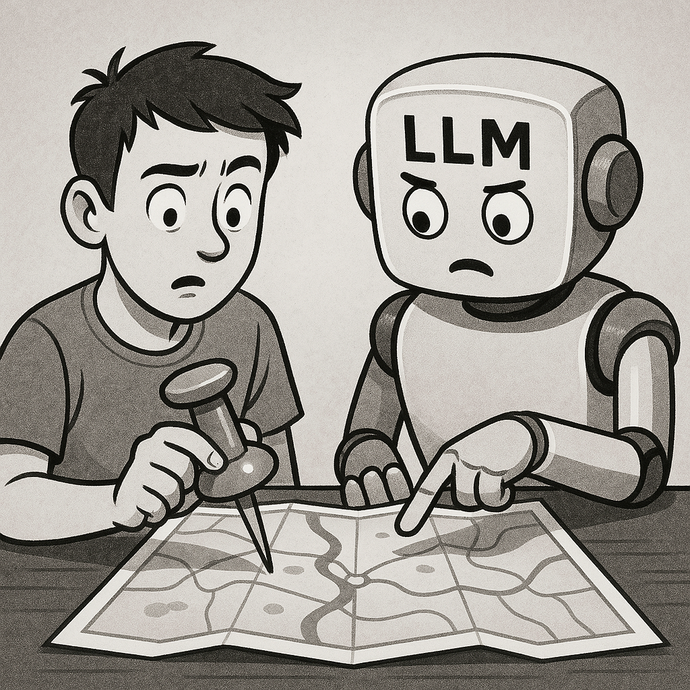

# The Human-Friendly Guide to ENPF

<figure><figcaption></figcaption></figure>

## Why You Might Care About ENPF

Have you ever felt that talking to AI is like giving directions to someone who takes everything too literally? Or perhaps you've experienced the opposite — asking for something specific but getting a vague, generic response?

The Enhanced Natural Prompting Framework (ENPF) is designed to solve these problems. It's not about complicated programming or learning a new language. Instead, think of it as a simple set of signposts that help you guide AI toward giving you exactly what you need.

***

**Note on Creation**: This entire book was generated with Claude, and the images were created with ChatGPT. The Enhanced Natural Prompting Framework (ENPF) represents a collaborative effort between human guidance and AI capabilities, demonstrating the power of structured communication that the framework itself promotes.
