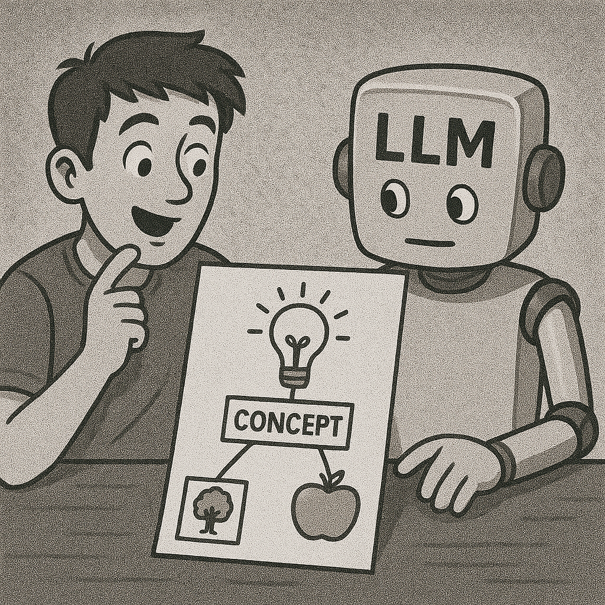

# Elegant Approaches: Creative Ways to Use ENPF

## Reverse Prompting: Let the AI Ask You Questions

<figure><figcaption></figcaption></figure>

One of the most powerful approaches is "reverse prompting" — where you set up the AI to ask you targeted questions instead of immediately generating content.

```md
#ROLE: Expert UX Designer
You are a senior UX designer with 15 years of experience.

#APPROACH: Consultation Session
Instead of immediately designing my app, ask me questions about my users, goals, and preferences to understand my needs better.

I need a design for a fitness tracking app. Please start our consultation.
```

This creates a collaborative experience where the AI helps draw out information you might not have thought to provide.

## Progressive Disclosure: Building Complex Outputs in Stages

<figure><figcaption></figcaption></figure>

For complex projects, you can use ENPF to guide a step-by-step approach:

```md
I need to create a business plan.

#PHASE: Research Questions
Please ask me key questions about my business idea, market, and resources before moving to the next phase.

#PHASE: Outline Development
After gathering information, organize it into a structured business plan outline for my approval.

#PHASE: Section Drafting
Once the outline is approved, we'll work through each section step-by-step.
```

## Multi-Perspective Analysis: Seeing All Angles

<figure><figcaption></figcaption></figure>

When you need to consider different viewpoints:

```md
I'm trying to decide whether to switch careers.

#APPROACH: Multi-Perspective Analysis

#PERSPECTIVE: Financial Advisor
What financial implications should I consider?

#PERSPECTIVE: Career Coach
How might this align with my long-term goals?

#PERSPECTIVE: Work-Life Balance Expert
How will this affect my personal life and wellbeing?
```

## Concept Mapping: Exploring Connections

<figure><figcaption></figcaption></figure>

For understanding complex topics:

```md
Help me understand quantum computing.

#CONCEPT: Quantum Superposition
Explain this concept in simple terms.

#ANALOGY: Superposition → Spinning Coin
Create an everyday analogy to help me understand.

#CONCEPT: Quantum Entanglement
Explain this related concept and how it connects to superposition.
```

## Best Practices: Simple Tips for Powerful Results

### 1. Start Simple, Add as Needed

Begin with just a few hashtags for the most important aspects. You can always add more detail later. For example:

**Starting simply:**

```md
#APPROACH: Beginner-friendly
#FOCUS: Core concepts only
Help me understand how blockchain works.
```

**Adding more structure as needed:**

```md
Thanks, now I'd like to go deeper.

#STRUCTURE:
1. Technical mechanisms
2. Security aspects
3. Practical applications

#EMPHASIS: Real-world examples
I learn best through concrete examples.
```

### 2. Mix Natural Language with ENPF

You don't need to put everything under a hashtag. Mix natural conversation with structured elements:

```md
I loved your explanation of blockchain! Could you create a short article about it for my technology blog?

#AUDIENCE: Tech-interested general public
My readers have basic technical knowledge but aren't developers.

The article should be engaging and include some visuals you can describe. Don't worry about making it too comprehensive — just an interesting 5-minute read.
```

### 3. Use Descriptive Tag Names

While ENPF has suggested hashtags, feel free to create your own that make sense to you:

```md
#MAKE_IT_FUNNY: Include some light humor
#ELI5: Explain like I'm 5 years old
#TECH_LEVEL: Advanced programmer
```

### 4. Create Custom Templates for Repeated Tasks

For tasks you do regularly, create your own ENPF template:

```md
## My Weekly Marketing Email Template

#STRUCTURE:
1. Attention-grabbing headline
2. One key industry update
3. Our company's perspective
4. Call to action

#TONE: Informed and insightful
#LENGTH: 300-400 words
#ALWAYS_INCLUDE: Our brand tagline "Innovation Through Insight"

[Just paste in the specific details each week]
```

### 5. Iterate and Refine

If you don't get exactly what you need, use ENPF to refine:

```md
That's a good start, but:

#ADJUST: Technical level
Please make it more accessible to beginners.

#EXPAND: The section about security
This needs more detail and examples.
```
